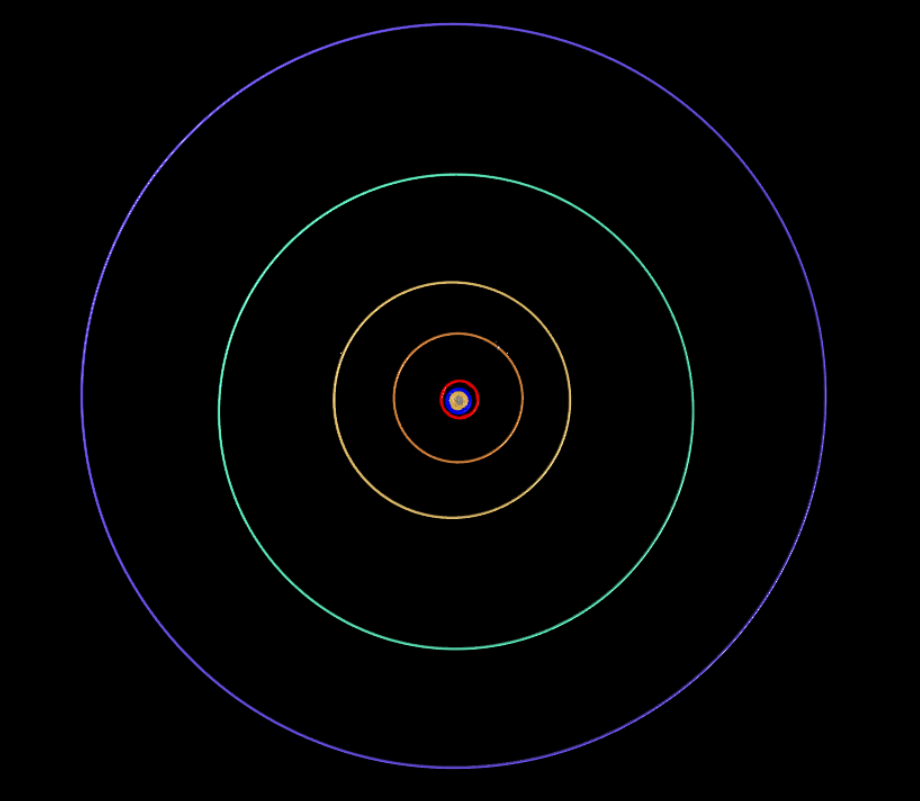

# MP2

EEEN30150 Modelling and Simulation, Minor Project 2.
Numerical simulation of the solar system using Newton's law of gravitation.

# Installation
```bash
git clone https://github.com/francisfagan/MP2.git
cd MP2/
```
## Python dependencies
```bash
vpython
tqdm
matplotlib
numpy
```
# Usage
```bash
python python/main.py [--dt <time difference in seconds>] [--years <years>] [--visual <plot || anim>] [--frame_skip <frames_to_skip>] [--texture_dir <path_to_directory>] [--fps <fps>]
```
| Argument | Type | Default | Description |
|---|---|---|---|
| `--dt` | int | 3600 | Timestep in seconds (default is 1 hour) |
| `--years` | int | 10 | Simulation duration in years |
|`--method`| str | leapfrog | Specifices the method used for numerical integration. Other methods are `rk4` and `abm4` |
| `--visual` | str | anim | Visualisation as plot or animation, can also choose `plot` |
| `--frame_skip` | int | 10 | Skips a specified amount of frames |
| `--fps` | int | 30 | Frames per second for animation |
| `--texture_dir` | path | textures/ | Path to textures for simulations (jpgs) |

# Examples
Below are examples for exectuting the simulation. 
```bash
# normal plot for 10 years with default dt
python python/main.py --visual plot --years 10

# animation for 5 years with an hour timestep
python python/main.py --visual ani --years 5 --dt 7200

# higher skip_frames allows for faster animation
python python/main.py --visual ani --skip_frames 50

# animation for default length and dt using method abm4
python python/main.py --method abm4
```

# Sources
https://www.solarsystemscope.com/

https://www.planetaryvisions.com/Top.php?cat=4

https://ssd.jpl.nasa.gov/horizons/app.html#/